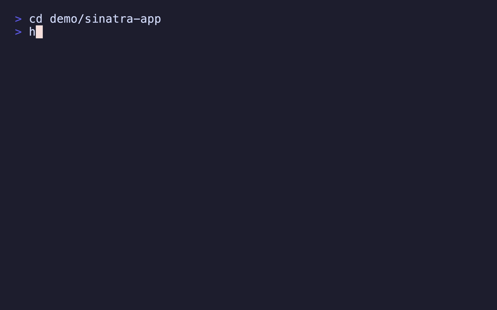

# hdi - "How do I..."

_"...run this thing?"_

Scan a project's README and extract the commands you (probably) need to get it running. No more opening up the whole project in your editor and scrolling through docs to find the `install`, `run` and `test` steps.

```
$ cd some-project
$ hdi
[hdi] some-project

 ▸ Installation
  ▶ npm install
    cp .env.example .env

 ▸ Run
    npm run dev

  ↑↓ navigate  ⇥ sections  ⏎ execute  c copy  q quit
```

See the [blog post](https://blog.gregdev.com/posts/2026-03-18-hdi-a-cli-tool-to-extract-run-commands-from-project-readmes/) for more background information, and the [website](https://hdi.md) for an interactive demo.

## Example

<picture>
  <source media="(prefers-color-scheme: dark)" srcset="./demo/demo-mocha.gif" alt="Animated demo showing hdi in action" width="800">
  <source media="(prefers-color-scheme: light)" srcset="./demo/demo-latte.gif" alt="Animated demo showing hdi in action" width="800">
  
</picture>

## Install

### Homebrew (macOS/Linux)

```bash
brew install grega/tap/hdi
```

#### Update

```bash
brew update
brew upgrade hdi
```

### Manual

```bash
mkdir -p ~/.local/bin
curl -fsSL https://raw.githubusercontent.com/grega/hdi/main/hdi -o ~/.local/bin/hdi
chmod +x ~/.local/bin/hdi
```

Make sure `~/.local/bin` is on your `$PATH`.

## Usage

```
hdi                    Interactive picker - shows all sections (default)
hdi install            Just install/setup commands (aliases: setup, i)
hdi run                Just run/start commands (aliases: start, r)
hdi test               Just test commands (alias: t)
hdi deploy             Just deploy/release commands and platform detection (alias: d)
hdi all                All sections (aliases: a)
hdi contrib            Commands from contributor/development docs (alias: c)
hdi needs              Check if required tools are installed (alias: n)
hdi /path/to/project   Scan a different directory
hdi /path/to/file.md   Parse a specific markdown file
```

Running `hdi` with no subcommand currently shows all matched sections (equivalent to `hdi all`). The subcommands exist to filter down to a specific category. In future, if the default output becomes too noisy, `hdi` may return a curated subset while `hdi all` continues to show everything.

Short-forms:

```
hdi i      Install/setup commands
hdi r      Run/start commands
hdi t      Test commands
hdi d      Deploy/release commands
hdi a      All sections
hdi c      Contributor/development docs
hdi n      Check required tools
```

### Flags

```
-h, --help                   Show help
-v, --version                Show version
-f, --full                   Show surrounding prose, not just commands
    --raw                    Plain markdown output (no colour, for piping)
    --json                   Structured JSON output (includes all sections)
    --ni, --no-interactive   Non-interactive (just print, no picker)
```

Example: `hdi --raw | pbcopy` to copy commands to clipboard.

### Interactive controls

| Key | Action |
|-----|--------|
| `↑` `↓` / `k` `j` | Navigate commands |
| `Tab` / `Shift+Tab` | Jump between sections |
| `Enter` | Execute highlighted command |
| `c` | Copy highlighted command to clipboard |
| `q` / `Esc` | Quit |

### Deployment platform detection

The `deploy` (or `d`) subcommand makes a best effort to extract what platform(s) a project uses for deployment (eg. Cloudflare, Heroku, Vercel, Netlify, AWS, etc), and displays this in the output:

```bash
$ hdi d
[hdi] example-project  [deploy → Cloudflare Pages]
...
```

Or if the certainty is low:

```bash
$ hdi d
[hdi] example-project  [deploy → Netlify?]
...
```

## How it works

`hdi` parses a given README's Markdown headings looking for keywords like *install*, *setup*, *prerequisites*, *run*, *usage*, *getting started*, etc. It extracts the fenced code blocks from matching sections (skipping JSON/YAML response examples) and presents them as an interactive, executable list.

Also looks for `README.rst` / `readme.rst`, though Markdown READMEs work best.

No dependencies, just Bash. Works on macOS and Linux.

## Development

See `DEVELOPMENT.md` for instructions on setting up a local development environment, running tests, benchmarking, and generating demo GIFs.

## AI transparency

AI tooling (eg. Claude Code) has been used to assist with areas of the project, such as:

- Researching common README formats across a large array of project types, and creating fixtures from these findings
- Prototyping the parsing logic
- Creating the website's data generation pipeline, along with elements of the demo page's terminal simulator
- Converting the use of `sed`, `awk` etc into Bash natives (ie. the [v0.10.0](https://github.com/grega/hdi/releases/tag/v0.10.0) performance release)

## License

[MIT](LICENSE)
